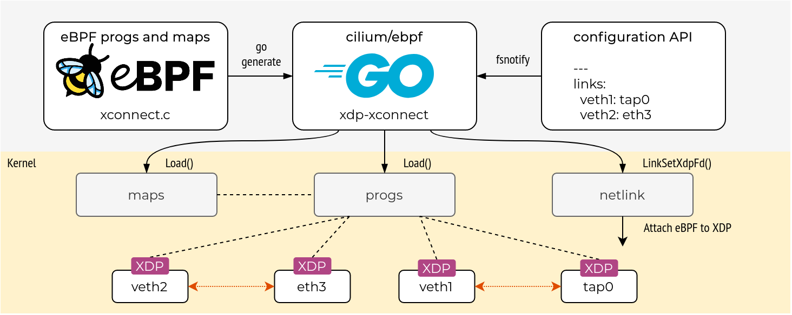

```
  
---
original: https://networkop.co.uk/post/2021-03-ebpf-intro/
author: Michael Kashin
translator: https://github.com/bigdimple
reviewer: 
title: Getting Started with eBPF and Go
summary: 使用GO开始入门eBPF
categories: kubernetes
tags: eBPF/go
originalPublishDate: 2021-09-06
publishDate: 2021-09-29
---

```

# 用GO开始入门eBPF

[eBPF](https://ebpf.io/what-is-ebpf/) 本身及其周边应用,包括 [XDP](https://github.com/xdp-project/xdp-tutorial) 拥有一个蓬勃发展的生态系统，同时也拥有大量的教程资料。每当用户在选择库以及工具与 eBPF 进行交互和编排时候，往往会无从下手。
因为你必须在基于 python 的 [BCC](https://github.com/iovisor/bcc) 框架或者基于 c 的 [libbpf](https://github.com/libbpf/libbpf) ,以及来自 [Dropbox](https://github.com/dropbox/goebpf)、 [Cilium](https://github.com/cilium/ebpf)、 [Aqua](https://github.com/aquasecurity/tracee/tree/main/libbpfgo) 和 [Calico](https://github.com/projectcalico/felix/tree/master/bpf) 等一系列基于 go 的库之间进行选择。
另一个经常被忽略的重要领域是 eBPF 代码的“生产化”，即从手动检测示例转向生产级应用程序，如 Cilium程序。
在这篇文章中，我将记录我在这方面的一些心得，尤其是使用 Go 编写的用户空间控制器的网络(XDP)应用程序时的经验。

## 选择一个 eBPF 库

在大多数情况下，eBPF 库可以帮助你实现以下两点:

* **加载 eBPF 程序和 map** 到内核中，然后执行[重定位](https://kinvolk.io/blog/2018/10/exploring-bpf-elf-loaders-at-the-bpf-hackfest/#common-steps)，通过文件描述符将 eBPF 程序的 map 正确的关联起来。
* **与 eBPF map 交互**，允许对存储在这些 map 中的 key/value 执行所有标准的 CRUD 操作。

有些库还可以将 eBPF 程序附加到特定的 [hook](https://ebpf.io/what-is-ebpf/#hook-overview) 上，对于网络用例来说，可以很容易的使用任何 netlink API 库来完成。
所以在选择 eBPF 库时，我并不是唯一一个感到困惑的人(参考[[1]](https://k8s.networkop.co.uk/cni/cilium/#a-day-in-the-life-of-a-packet)和[[2]](http://arthurchiao.art/blog/cilium-life-of-a-packet-pod-to-service/))。每个 librarie 都有自己的适用范围和限制条件:

* [Calico](https://github.com/projectcalico/felix/tree/master/bpf) 实现了一个围绕由 [bpftool](https://twitter.com/qeole/status/1101450782841466880) 和 iproute2 制作的 CLI 命令的 Go 包装器。
* [Aqua](https://github.com/aquasecurity/tracee/tree/main/libbpfgo) 实现了一个围绕 libbpf c 库的 Go 包装器
* [Dropbox](https://github.com/dropbox/goebpf) 支持一小部分程序，但有一个非常干净和方便的用户 API
* IO Visor 的 [gobpf](https://github.com/iovisor/gobpf) 是 BCC 框架的 go 绑定集合，它更侧重于跟踪和分析
* [Cilium 和 Cloudflare](https://github.com/cilium/ebpf) 维护的一个[Go语言的库](chrome-extension://ikhdkkncnoglghljlkmcimlnlhkeamad/pdf-viewer/web/viewer.html?file=https%3A%2F%2Flinuxplumbersconf.org%2Fevent%2F4%2Fcontributions%2F449%2Fattachments%2F239%2F529%2FA_pure_Go_eBPF_library.pdf)(在下面称为 <font color=SandyBrown>libbpf-Go</font>) ，将所有 eBPF 系统调用抽象到本地 Go 接口之后。

对于我的特定于网络的用例，虽然我很喜欢 Dropbox（因为简单），而且之前也用过它。但我最终使用了 libbpf-go，因为 Cilium 和 Cloudflare 使用的就是这个库，而且它有一个活跃的社区。

为了熟悉开发过程，我决定实现一个 XDP 交叉连接应用程序，它在网络拓扑模拟中有一个非常合适而且重要的[用例](https://netdevops.me/2021/transparently-redirecting-packets/frames-between-interfaces/)。我们的目标是让应用程序监视配置文件，并确保本地接口根据该文件中的 YAML 规范相关联。下面是对 xdp-xconnect 工作原理的高级概述:




以下部分将逐步描述应用程序构建和交付过程，更多地关注集成，而较少关注实际代码。可以在Github上找到 Xdp-xconnect 完整的代码。


## 第一步：编写 eBPF 代码

一般这是任何“使用 eBPF 入门”文章的主要部分，但这一次它不是重点。我不认为我能教别人如何写 eBPF，但是我可以提供一些非常好的参考资源，希望对你有所帮助：
* 学习常用的 eBPF 理论和一些技术细节点，在 [eBPF.io](https://ebpf.io/what-is-ebpf/) 网站中以及 Cilium 中的 eBPF 和 XDP [参考指南](https://docs.cilium.io/en/stable/bpf/)中。
* 使用 eBPF 和 XDP 进行一些实践操作的最佳参考项目是 [XDP-tutorial](https://github.com/xdp-project/xdp-tutorial)。这是个非常棒的参考项目，即使你最终没有完成任务，也绝对值得一读。
* Cilium 的[源代码](https://github.com/cilium/cilium/tree/master/bpf)及其在[[1]](https://k8s.networkop.co.uk/cni/cilium/#a-day-in-the-life-of-a-packet)和[[2]](http://arthurchiao.art/blog/cilium-life-of-a-packet-pod-to-service/)中的分析。

我的 eBPF 程序非常简单，它由一个对 eBPF [helper function](https://man7.org/linux/man-pages/man7/bpf-helpers.7.html) 的调用组成，该函数根据输入接口的索引将所有数据包从一个接口重定向到另一个接口。

```yaml
#include <linux/bpf.h>
#include <bpf/bpf_helpers.h>
SEC("xdp")
int  xdp_xconnect(struct xdp_md *ctx)
{
    return bpf_redirect_map(&xconnect_map, ctx->ingress_ifindex, 0);
}
```

为了编译上面的程序，我们需要为所有包含的头文件提供搜索路径。最简单的方法是复制 [linux/tools/lib/bpf/](https://git.kernel.org/pub/scm/linux/kernel/git/netdev/net-next.git/tree/tools/lib/bpf) 下的所有文件，但是这包括了许多不必要的文件。因此，另一种方法是创建一个依赖项列表:
```yaml
$ clang -MD -MF xconnect.d -target bpf -I ~/linux/tools/lib/bpf -c xconnect.c
```
现在，我们只能对 xconnect.d 中指定的某些文件进行本地复制，并使用以下命令为本地 CPU 架构编译 eBPF 代码:
```yaml
$ clang -target bpf -Wall -O2 -emit-llvm -g -Iinclude -c xconnect.c -o - | \
llc -march=bpf -mcpu=probe -filetype=obj -o xconnect.o
```
得到的 ELF 文件是我们下一步需要提供给 Go 库的。

## 第二步：编写 Go 代码
通过 libbpf 加载已编译的 eBPF 程序和 map 只需要几条指令。通过添加带 ebpf 标签的结构，我们可以自动化重定位过程，这样我们的程序就知道在哪里找到它的 map。
```yaml
spec, err := ebpf.LoadCollectionSpec("ebpf/xconnect.o")
if err != nil {
    panic(err)
}

var objs struct {
    XCProg  *ebpf.Program `ebpf:"xdp_xconnect"`
    XCMap   *ebpf.Map     `ebpf:"xconnect_map"`
}
if err := spec.LoadAndAssign(&objs, nil); err != nil {
	panic(err)
}
defer objs.XCProg.Close()
defer objs.XCMap.Close()
```
Type ebpf.Map 有一组方法，这些方法对加载的 Map 的内容执行标准的 CRUD 操作:
```yaml
err = objs.XCMap.Put(uint32(0), uint32(10))

var v0 uint32
err = objs.XCMap.Lookup(uint32(0), &v0)

err = objs.XCMap.Delete(uint32(0))
```
Libbpf-go 没有涵盖的步骤是将程序附加到 network hook 上。然而任何现有的网络链接库，例如 [vishvananda/netlink](https://github.com/vishvananda/netlink)，都可以通过将网络链接与加载程序的文件描述符关联起来，轻松实现这一点:
```yaml
link, err := netlink.LinkByName("eth0")
err = netlink.LinkSetXdpFdWithFlags(*link, c.objs.XCProg.FD(), 2)
```
注意，我使用 [SKB_MODE](https://github.com/torvalds/linux/blob/master/tools/include/uapi/linux/if_link.h#L966) XDP 标志来解决退出的驱动程序[caveat](https://github.com/xdp-project/xdp-tutorial/tree/master/packet03-redirecting#sending-packets-back-to-the-interface-they-came-from)。虽然本机 XDP 模式比任何其他 eBPF hook 都要[快很多](https://www.netronome.com/media/images/fig3.width-800.png)，但 SKB_MODE 可能不会那么快，因为网络堆栈必须预先解析包头([参见视频](https://www.youtube.com/watch?v=q3gjNe6LKDI))。


## 第三步：代码分发

此时，如果我们的应用程序没有出现问题 —— 根据 eBPF [代码可移植性](https://facebookmicrosites.github.io/bpf/blog/2020/02/19/bpf-portability-and-co-re.html#the-problem-of-bpf-portability)，那么一切应该准备就绪，可以进行打包和发布了。

从历史上看，这个过程包括将 eBPF 源代码复制到目标平台，提取所需的内核头并为特定的内核版本编译它。这个问题在跟踪/监视/分析用例时尤其明显，这些用例可能需要访问几乎任何内核数据结构，因此唯一的解决方案是引入另一个间接层([参见 CO-RE](https://facebookmicrosites.github.io/bpf/blog/2020/02/19/bpf-portability-and-co-re.html))。

另一方面，网络用例依赖于一个相对较小且稳定的内核类型子集，因此它们不会遇到跟踪和分析对应方所遇到的同类问题。根据我目前看到的，两种最常见的代码打包方法是:
* 将 eBPF 代码与所需的 kernel headers 一起发布，前提是它们与底层内核匹配([参见 Cilium](https://github.com/cilium/cilium/tree/master/bpf))
* 发布 eBPF 代码并提取目标平台上的 kernel headers 文件

在这两种情况下，eBPF 代码仍然是在目标平台上编译的，这是在用户空间应用程序启动之前需要执行的额外步骤。

还有一种替代方法是预编译 eBPF 代码,只发送 ELF 文件。这正是 bpf2go 可以做到的，它可以将编译后的代码嵌入到 Go 包中。它依靠 go generate 生成一个[新文件](https://github.com/networkop/xdp-xconnect/blob/main/pkg/xdp/xdp_bpf.go)，其中包含已编译的 eBPF 和 libbpf-go 框架代码，唯一的要求是需要 //go: generate 指令。一旦生成，我们的 eBPF 程序可以只加载几行代码(注意没有任何参数) :
```yaml
specs, err := newXdpSpecs()
objs, err := specs.Load(nil)
```
这种方法的明显好处是：我们不再需要在目标机器上进行编译，可以将 eBPF 和用户空间 Go 代码同时发布在一个包或 Go 二进制文件中。还有一个优点是，它允许我们不仅将应用程序作为二进制文件使用，而且还可以将其导入到任何第三方 Go 应用程序中([参见使用示例](https://github.com/networkop/xdp-xconnect#usage))。

## 阅读一些参考资料

通用理论知识:
```
Https://github.com/xdp-project/xdp-tutorial
Https://docs.cilium.io/en/stable/bpf/
Https://qmonnet.github.io/whirl-offload/2016/09/01/dive-into-bpf/
```
BCC 和 libbpf:
```
Https://facebookmicrosites.github.io/bpf/blog/2020/02/20/bcc-to-libbpf-howto-guide.html
Https://nakryiko.com/posts/libbpf-bootstrap/
Https://pingcap.com/blog/why-we-switched-from-bcc-to-libbpf-for-linux-bpf-performance-analysis
Https://facebookmicrosites.github.io/bpf/blog/
```
eBPF/XDP 性能相关:
```
Https://www.netronome.com/blog/bpf-ebpf-xdp-and-bpfilter-what-are-these-things-and-what-do-they-mean-enterprise/
```
linux 内核编码方式:
```
Https://www.kernel.org/doc/html/v5.9/process/coding-style.html
```
Libbpf-go 示例程序:
```
https://github.com/takehaya/goxdp-template
https://github.com/hrntknr/nfNat
https://github.com/takehaya/Vinbero
https://github.com/tcfw/vpc
Https://github.com/florianl/tc-skeleton
https://github.com/cloudflare/rakelimit
Https://github.com/b3a-dev/ebpf-geoip-demo
```
Bpf2go:
```
Https://github.com/lmb/ship-bpf-with-go
Https://pkg.go.dev/github.com/cilium/ebpf/cmd/bpf2go
```
XDP 示例程序:
```
Https://github.com/cpmarvin/lnetd-ctl
Https://gitlab.com/mwiget/crpd-l2tpv3-xdp
```


