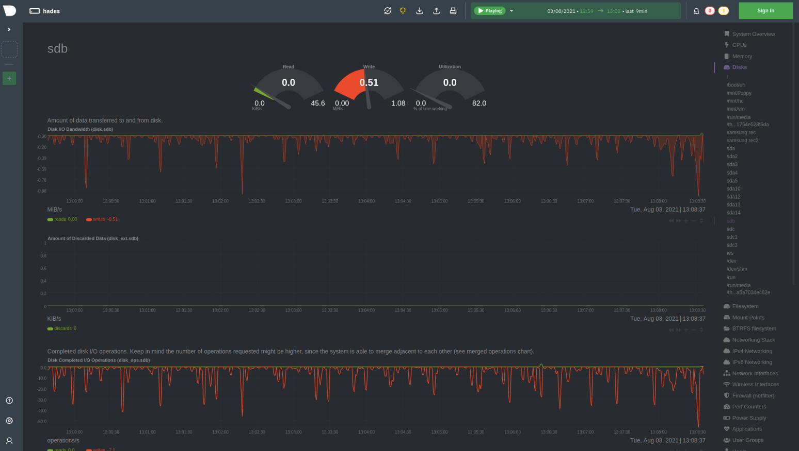
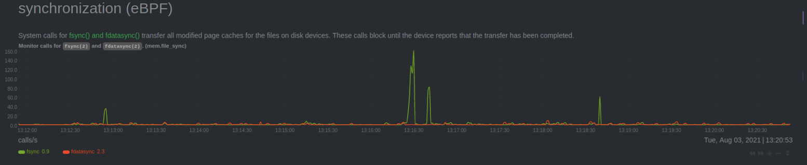
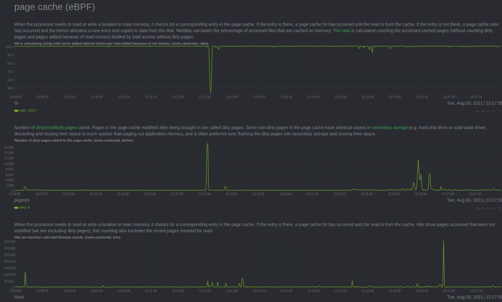
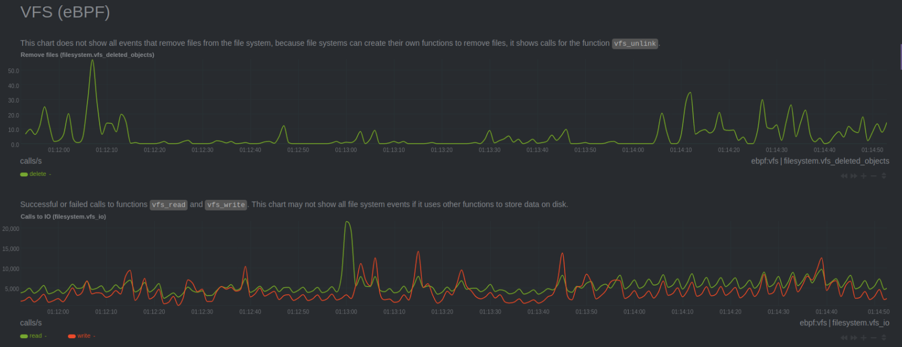
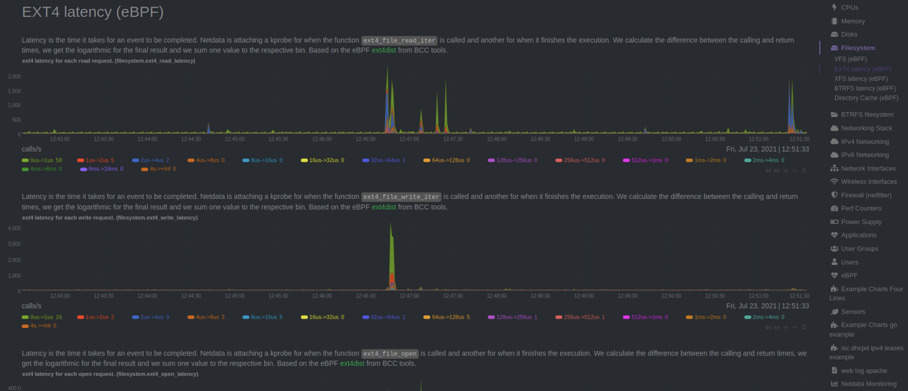

# 现在使用 eBPF 如何监视您的磁盘和文件系统？

2021 年 8 月 16 日 马诺斯 · 萨拉蒂斯

## eBPF 简介
当前的 IT 监控软件缺乏系统和应用程序最小停机时间的必要指标度量。大多数 IT 监控软件提供系统和应用程序指标，但要正确监控您的基础架构所需的远不止这些。随着[ eBPF ](https://ebpf.io/)的产生和不断进步，eBPF 技术允许监视软件从 Linux 内核提供了更丰富的监控信息并将其呈现出来。具体而言，eBPF 监控可以更好地了解内部系统究竟发生了什么，这有助于确定基础架构可以改进性能的地方。

在 Netdata，我们能够充分利用 eBPF 的能力使您的团队能够：

+ 充分利用 Linux 内核，提供基于从 Linux 内核直接采集出的监控数据，这些数据是前所未有的。
+ 通过新的、附加的指标和图表改进了监控范围，这些指标和图表具有关于硬盘、文件系统等方面更完整的信息。
+ 基于新的 eBPF 图表，使用一组新的用例补充警报，
+ 了解有关 Linux 内核及其隐藏但有实际用途的更多秘密信息。

作为基础，我们使用的代码最初是由[ IOvisor ](https://www.iovisor.org/)中的[ BCC ](https://github.com/iovisor/bcc)工具，[ Cloudflare ](https://www.cloudflare.com/)中的[ eBPF exporter ](https://github.com/cloudflare/ebpf_exporter)开发的；我们非常感谢他们的贡献，并打算扩大他们的工作范围，将这些工具的价值分享给你们所有人。

Netdata 是所有 eBPF 工具的超集。此外，通过消除配置上的开销，我们简化了可视化信息之前的整个过程。Netdata，你可以使用一个命令安装我们的监控代理，把它连接到一个在[ Cloud ](https://app.netdata.cloud/?utm_source=website&utm_content=get_netdata_button1)上的[ Space ](https://learn.netdata.cloud/docs/cloud/spaces)，开箱即用的 eBPF 监控，避免了寻找 eBPF工具，需要编译，运行，收集的复杂性和存储输出以及开发用于故障排除的可视化所需的配置。我们为您处理这些所有的复杂性。只需[在您的代理上启用 eBPF ](https://learn.netdata.cloud/docs/agent/collectors/ebpf.plugin)，您就可以开始使用了！

## 磁盘监控和预警

Netdata 通过在现有的仪表盘上提供的许多开箱即用的图表来监控您的所有磁盘。这些数据包括但不限于：
+ <strong>磁盘 I/O 带宽：</strong>磁盘的数据流的输入和输出
+ <strong>丢弃数据量：</strong>从块设备读取、写入或[丢弃](https://access.redhat.com/documentation/en-us/red_hat_enterprise_linux/8/html/managing_storage_devices/discarding-unused-blocks_managing-storage-devices)的扇区数。要配置丢弃，请访问此[文档](https://wiki.gentoo.org/wiki/SSD)，获取有关使用丢弃和 Netdata 仪表板的更多信息，您也可以参阅这篇[文章](https://lwn.net/Articles/347511/)以了解更多信息。 
+ <strong>磁盘完成的 I/O 操作：</strong>读取或写入成功完成的总数据量
+ <strong>磁盘已完成扩展 I/O 操作：</strong> I/O 操作完成后被丢弃的 blocks 数和刷新数
+ <strong>磁盘当前 I/O 操作与 I/O：</strong>当前正在进行的操作。
+ <strong>磁盘积压： </strong>待处理的磁盘操作的等待时间
+ <strong>磁盘拥塞时间</strong>测量<strong>磁盘拥塞的时间</strong>
+ <strong>磁盘使用时间</strong>
+ <strong>平均完成 I/O 操作时间</strong>成功完成的读取和写入的操作
+ <strong>平均完成的扩展 I/O 操作时间</strong>与丢弃和刷新时间
+ <strong>平均完成的 I/O 操作带宽 </strong>
+ <strong>平均丢弃数据量</strong>
+ <strong>已完成 I/O 操作的平均服务时间</strong>
+ <strong>磁盘合并操作</strong>作为彼此相邻的读取和写入可以合并以提高效率
+ <strong>磁盘合并丢弃操作</strong>所有已完成 I/O 的总计的 I/O 时间
+ <strong>磁盘总计 I/O 时间</strong>每次刷新、丢弃的扩展操作

现在，使用 eBPF，您还可以获得以下额外指标：
+ <strong>磁盘延迟 ( eBPF )：</strong>延迟图表显示直方图以及读取和写入数据所需的时间。
+ <strong>同步 ( eBPF )：</strong>当数据从内存页面缓存移动到硬盘时。
+ <strong>页面缓存 ( eBPF )：</strong>数据如何在主机上实时更改。
+ <strong>挂载点监控 ( eBPF )：</strong>当分区/磁盘被移除并插入到您的主机上时。

我们为以下项目提供预建预警：
+ 磁盘利用率
+ Inode 利用率，您可以在[此处](https://en.wikipedia.org/wiki/Inode)找到有关磁盘 Inode 的更多信息。 
+ 磁盘积压
+ 延迟

对于每个挂载点 Netdata 提供：

<strong>磁盘空间使用</strong>

磁盘空间利用率。reserved for root 是系统自动预留的，防止 root 用户空间不足。

<strong>磁盘文件（ inode ）使用</strong>——耗尽可用的 inode（或索引节点）会导致无法创建新文件的问题。
inodes（或索引节点）是文件系统对象（例如文件和目录）。在许多类型的文件系统实现中，inode 的最大数量在文件系统创建时是固定的，限制了文件系统可以容纳的最大文件数量。设备可能会耗尽 inode。发生这种情况时，即使可能有可用空间，也无法在设备上创建新文件。

<strong>挂载系统调用 ( eBPF )</strong>
+ 当系统调用挂载和卸载时，调用 Monitor 。
+ 当设备从计算机中插入或移除时，这可能是硬件问题、安全问题。

还有一个[ SMART 插件](https://learn.netdata.cloud/docs/agent/collectors/python.d.plugin/smartd_log)，但我们不建议使用它，因为您的数据可能会受到损害。默认情况下不启用。

## 文件系统监控
Netdata 监控不同的文件系统，例如：
+ 虚拟文件系统( eBPF )
    + 删除文件 – 监控 Linux 上删除文件的频率；
    + 对 IO 的调用 - 计算从硬盘写入(输入)和读取(输出)事件的数量
    + 写入和读取的字节数 - 对上一个图表的补充，但为了测量（字节数）调用。
    + 调用 vfs_fsync – 监视操作系统何时调用文件同步以将内存中更改的页面存储到磁盘。
    + 调用 vfs_open – 调用打开文件
    + 调用 vfs_create – 调用创建新文件的函数
+ EXT4、XFS、BTRFS、ZFS 延迟( eBPF )
    + 读取请求的延迟以及从 ext4 文件系统读取数据所需的时间。 
    + 写入请求的延迟以及执行写入事件所需的时间。
    + 打开请求的延迟以及执行打开事件所需的时间。
    + 同步延迟请求执行同步所需的时间。
+ NFS ( eBPF )
    + 读取请求的 NFS 延迟以及执行读取事件所需的时间。
    + 写入请求的 NFS 延迟以及执行写入事件所需的时间。
    + 打开请求的 NFS 延迟以及执行打开事件所需的时间。
    + getattr 请求的 NFS 延迟以及执行 getattr 请求所需的时间。
+ 挂载文件系统( eBPF )
    + Netdata 正在监视文件系统何时在操作系统上安装和卸载。

## 同步

+ 同步 ( eBPF )：Netdata 监控六个不同的系统调用（fsync 、fdatasync 、msync 、sync 、syncfs 和 syncfilerange ），负责将数据从页面缓存同步到磁盘。
+ 页面缓存( eBPF )：Netdata 监控同步到磁盘的页面缓存的访问和更改。

我们现在提供更多增强指标用于监控虚拟文件系统 ( [VFS](https://en.wikipedia.org/wiki/Virtual_file_system) ) ，还提供对某些文件系统执行打开文件、在磁盘上写入数据、从磁盘读取数据、删除文件和同步等操作所需的延迟的监控.

## eBPF 与 apps.plugin 的集成

一些图表显示文件系统和内存部分，并且在启用与 apps.plugin 的集成时也会按应用程序显示。由于这种集成，您可以看到特定应用程序如何使用硬盘。

应用程序集成

让我们看一个例子：

延迟是完成事件所需的时间。Netdata 计算函数调用与其返回之间的差异。最终结果按时间间隔存储。

每个硬盘都有自己的执行读写操作的延迟，要正确设置预警，我们建议您查看硬盘手册。

为了补充为硬盘提供的信息，Netdata 还监视文件系统上特定操作的延迟。

## 概括
感谢您光临并学习如何使用 Netdata 监控您的磁盘和文件系统！要获得丰富的体验，请免费注册[ Netdata Cloud ](https://app.netdata.cloud/sign-in?cloudRoute=spaces?utm_source=email&utm_content=ebpf_blog)（如果您还没有注册）并访问：
+ 来自多个节点的指标聚合到一个图表中。为此，只需创建一个帐户，将您的节点连接到一个 Space ，然后转到概览探索您的指标
+ 运行[指标关联](https://learn.netdata.cloud/docs/cloud/insights/metric-correlations)等智能功能，将特定指标的使用模式[关联](https://learn.netdata.cloud/docs/cloud/insights/metric-correlations)起来，这些指标在 Netdata 为您的系统收集的所有指标中具有相同的模式

最后，请记住[在您的代理上启用 eBPF ](https://learn.netdata.cloud/docs/agent/collectors/ebpf.plugin)！我们为磁盘和文件系统监控提供最全面的实时监控体验。只需轻松的加入监控！

如果您是 Netdata 的新手，请务必下载 Agent！如果您已经拥有代理，请注册 Netdata Cloud。